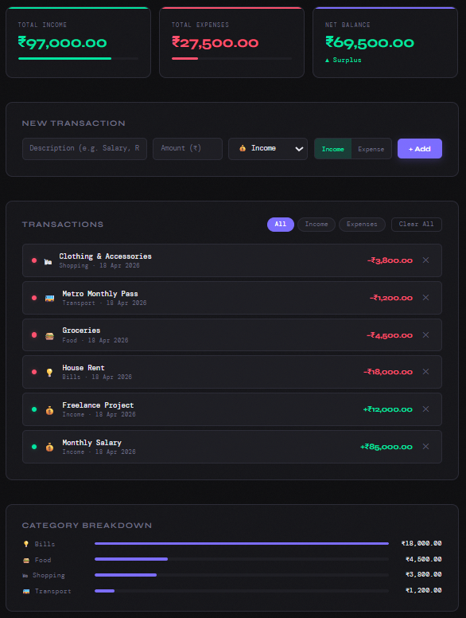

# 💰 Budget Tracker

> A sleek, real-time personal finance app to log, categorize, and monitor your income and expenses effortlessly.



---

## 📌 Table of Contents
 
- [Overview](#overview)
- [Features](#features)
- [Tech Stack](#tech-stack)
- [Project Structure](#project-structure)
- [Getting Started](#getting-started)
- [Usage](#usage)
- [Live Demo](#live-demo)
- [Screenshots](#screenshots)
- [Contributing](#contributing)
- [License](#license)

---

## Overview

**Budget Tracker** is a lightweight, browser-based personal finance tool that helps you stay on top of your money. No sign-ups, no cloud, no complexity — just open it and start tracking. All your data is saved locally in your browser so it's always there when you come back.

---

## ✨ Features

- 💰 **Track Income & Expenses** — Log transactions with a description, amount, and category in seconds
- 📊 **Instant Summary** — Total income, total expenses, and net balance update live with every entry
- 🏷️ **Smart Categories** — Organize spending across Food, Transport, Shopping, Health, Entertainment, Bills, and more
- 📈 **Category Breakdown** — Animated progress bars show which categories consume the most of your budget
- 🔍 **Filter Transactions** — Switch between All, Income, and Expense views instantly
- 💾 **Persistent Storage** — Data is saved to `localStorage` — survives page refreshes and browser restarts
- 🌙 **Dark UI** — Modern, distraction-free dark interface designed for daily use
- 📱 **Responsive Design** — Works seamlessly on desktop, tablet, and mobile

---

## 🛠️ Tech Stack

| Technology | Purpose |
|---|---|
| HTML5 | Structure & markup |
| CSS3 | Styling, animations, responsive layout |
| Vanilla JavaScript | Logic, DOM manipulation, localStorage |
| Google Fonts | Typography (Syne + DM Mono) |

No frameworks. No dependencies. No build tools required.

---

## 📁 Project Structure

```
budget-tracker/
├── index.html      # Main HTML structure
├── style.css       # All styles and animations
├── script.js       # App logic and localStorage handling
├── preview.png     # App screenshot (used in README)
└── README.md       # Project documentation
└── LICENSE         # MIT License
```

---

## 🚀 Getting Started

### Run Locally

1. **Clone the repository**
   ```bash
   git clone https://github.com/narendersingh-088/budget-tracker.git
   ```

2. **Navigate to the folder**
   ```bash
   cd budget-tracker
   ```

3. **Open in browser**
   ```bash
   # Simply open index.html in any browser
   open index.html
   ```

No installation, no `npm install`, no build step needed.

---

## 📖 Usage

### Adding a Transaction

1. Enter a **description** (e.g. "Monthly Salary", "Groceries")
2. Enter the **amount** in ₹
3. Select a **category** from the dropdown (Food, Transport, Bills, etc.)
4. Choose the **type** — Income or Expense
5. Click **+ Add**

The summary cards, transaction list, and category breakdown all update instantly.

### Filtering Transactions

Use the **All / Income / Expenses** filter buttons to narrow down the transaction list.

### Deleting Transactions

Click the **✕** button on any transaction to remove it. Use **Clear All** to wipe everything.

### Category Breakdown

The breakdown section automatically appears once you have expense entries. Bars are proportional to spending — the longest bar is your biggest expense category.

---

## 🌐 Live Demo

🔗 [View Live on GitHub Pages](https://narendersingh-088.github.io/budget-tracker)

---

## 📸 Screenshots

### App Preview


---

## 🤝 Contributing

Contributions are welcome! Here's how to get started:

1. Fork the repository
2. Create a new branch
   ```bash
   git checkout -b feature/your-feature-name
   ```
3. Make your changes and commit
   ```bash
   git commit -m "Add: your feature description"
   ```
4. Push to your branch
   ```bash
   git push origin feature/your-feature-name
   ```
5. Open a **Pull Request**

---

## 📄 License

This project is open source and available under the [MIT License](LICENSE).

---

<div align="center">
  Made with ❤️ | Budget Tracker
</div>
